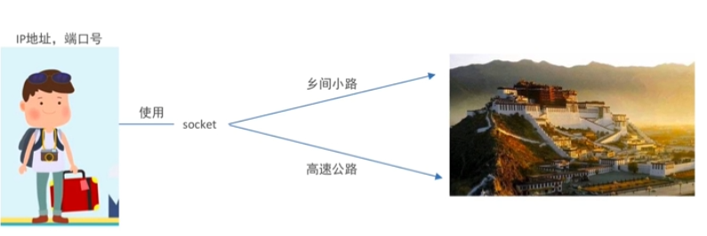
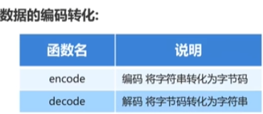
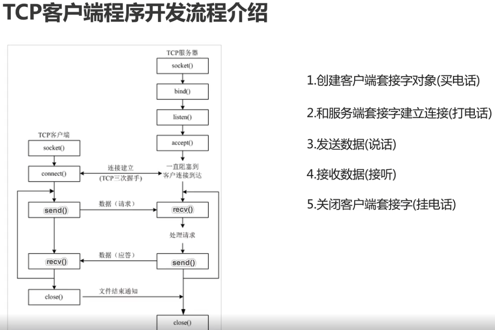
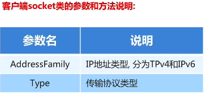
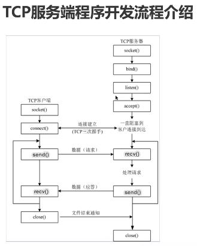
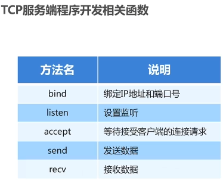

### 2、TCP的介绍
#### 2.1socker的介绍
1. 概念：程序之间想要进行通信需要基于这个socket
2. 只要跟网络相关的应用程序或者软件都会使用到socket

#### 2.2、TCP介绍
1. 使用网络传输的通讯方式，保证程序之间按照指定的传输规则进行数据的通信

2. 概念：TCP简称传输控制协议，他是一种面向连接的、可控的、基于字节流的传输层通信协议
3. 首先需要建立一个连接后才可以数据的传输，然后关闭连接

#### 2.3 TCP的特点
1. 面向连接：通信朔方必须要先建立好连接后才可以进行数据的传输，并且双方都会为此连接分配必要资源来记录连接的状态和信息， 当数据传输完成后，双反必须都要断开此连接以释放系统资源
2. 可靠传输：采用发送应答机制、超时重传（启动定时器，如果没有收到应答，过段时间会重新发送连接）、错误校验、流量控制和阻塞管理

#### 2.4 python3编码转换
1. 网络数据的传输：以二进制的数据进行传输，有一个**encode**编码和**decode**解码

2. 可以接受参数(encoding)：bytes.decode(encoding="utf-8"")

### 3、 TCP程序开发流程
#### 3.1 TCP客户端程序开发流程
1. 客户端：指运行在用户设备上的程序
2. 服务端：指运行在服务器设备上的程序，专门为客户端提供数据服务
3. 客户端程序开发流程如下图所示：

#### 3.2 TCP客户端程序开发
1. 用到的函数：socket、connect、send、recv、close
2. 导入socket：import socket
3. 创建客户端socket对象使用socket类：socket.socket(AddressFamily, Type)。其中两个参数和方法说明如下图：

#### 3.3 TCP服务端开发流程
1. 如下图所示，开发流程和客户端开发流程很相似，我们针对一些区别进行加以记忆就可以了：
2. 区别部分：多了三个函数：bind、listen、accept。没有connect函数
3. bind绑定IP地址和端口号，listen设置监听，accept等待接受客户端连接请求
4. 用到的函数如下：
