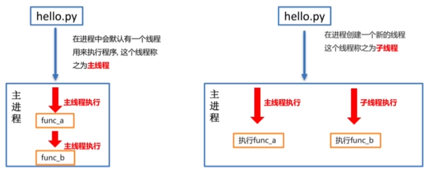
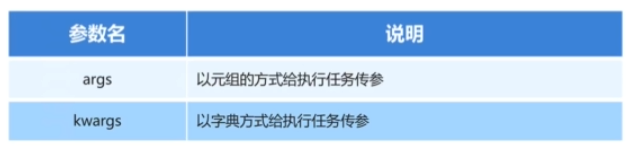

### 1、 多任务：表现形式
1. 并行计算：在一段时间内真正的同时一起执行多个任务，对于多核CPU来说，操作系统会给每一个内核安排一个任务去执行
2. 并发计算：在一段时间内交替去执行多个任务，称它为任务交替执行

### 2、 多进程：
#### 2.1 多进程的介绍
1. 进程是分配的资源最小单位，是操作系统进行资源分配和调度运行的基本单位
2. 程序运行会默认创建一个进程，称为主进程，程序运行后会创建一个进程叫子进程
#### 2.2 进程的创建步骤
1. 导入进程包：import multiprocessing 
2. 通过进程类创建进程对象： **进程对象** = multiprocessing.Process(target=（执行的目标任务名，这里是函数），name=（设置进程名）)
3. 启动进程执行任务：**进程对象**.start()

#### 2.3 进程执行带有参数的任务
1. args的使用：以元组的方式给函数传参。示例**进程对象** = multiprocessing.Process(target=coding，args(3,))
2. kargs的使用，以字典的方式给函数传参。示例**进程对象** = multiprocessing.Process(target=coding，kargs{"num":3})

#### 2.4 获取进程编号
1. 当进程数量越来越多的时候，就无法七分主进程和子进程还有不同的子进程，实际上每个进程都有自己的编号，通过获取编号来快速区分不同的进程
2. 获取当前进程编号：getpid()
3. 获取父进程编号：getppid()
4. 需要导入os扩展库：import os，使用os.getpid()
 
#### 2.5 进程间不共享全局变量
1. 不共享的原因：实际上创建一个子进程就是吧主进程的资源进行拷贝产生了了一个新的进程，这里的主进程和子进程都是相互独立的。
2. 演示代码：

#### 2.6 主进程和子进程的结束顺序
1. 主进程会等待所有子进程执行结束后再结束
2. 演示代码：
3. 守护主进程，当主进程结束后子进程直接销毁，不再执行子进程程序 :work_pross.daemon = True
4. 另外一种方式是，在主进程退出之前，杀死子进程：work_process.terminate()

### 3、多线程
#### 3.1 线程的介绍
1. 除了使用多进程来实现多任务外，线程也是实现多任务的一种途径，进程是分配资源的最小单位，线程是程序执行的最小单位
2. 实际上可以说进程是线程的容器，一个进程中最少有一个线程来负责执行程序，而且可以与同属一个进程的其他线程共享进程所拥有的全部资源。如下图所示，一个任务可以由多个进程进行执行，一个进程可以有多个线程进行执行程序

#### 3.2 多线程完成多任务
1. 线程的创建步骤：导入线程模块：import threading
2. 通过线程类创建线程对象：线程对象 = threading.Thread(target=任务命)
3. 启动线程执行任务：线程对象.start()

#### 3.2 线程执行带有参数的任务
1. 同样存在两个参数与进程参数一致：args()和kargs()

2. 要注意的点：元组方式传参一定要和参数的顺序保持一致
3. 字典方式传参的key一定要和参数名保持一致

#### 3.3 主线程和子线程的结束顺序
1. 主线程默认会等待所有子线程执行完毕后再结束
2. 要想改变结束顺序第一种方法，需要加入守护程序：work_pross.daemon = True
3. 第二种方法就是在主进程执行完后杀死子进程：work_process.terminate()

#### 3.4 线程间的执行顺序
1. 线程间的执行顺序是无序的,是由cpu的调度来决定某个线程先执行而不是谁先创建谁先执行，可以通过current_threed()来获取当前线程信息

#### 3.5 现场那个间的共享全局变量
1. 线程之间共享全局变量会出现错误问题，例如：定义两个函数，实现循环100万次，每循环一次给全局变量加1，创建两个子线程执行对应的两个函数，查看计算后的结果
2. 理论存在缺陷，但是实际运行是没有发生错误，100万次可以正常进行运算，再大就没有测试了
 
### 总结：进程和线程的对比
1. 关系对比：

线程实际上是依附于进程的，没有进程就没有线程

一个进程默认提供一条线程，也可以创建多个线程

2. 区别对比：

进程之间不可以共享全局变量

线程之间可以进程共享全局变量，但是要注意资源竞争的问题，解决方法：互斥锁或者线程同步

床间进程的资源开销比创建线程的开销大

进程是系统资源分配的基本单位，线程是cpu调度的基本单位

线程不能独立执行，必须依存于进程之中

3. 优缺点对比：

进程：可以使用多核，但是资源开销大

线程：资源开销小，但是不能使用多核

