### 1、复杂度
1. 算法的复杂度目前只关注时间复杂度。实际上是由时间复杂度和空间复杂度组成的

#### 1.1空间复杂度S(n)
1. 一个算法的空间复杂度S(n)定义为该算法所耗费的存储空间，空间复杂度是对一个算法在运行过程中临时占用储存空间大小的度量

#### 1.2时间复杂度O(n)
1. 

### 2、数据结构
#### 2.1 数据概念
1.  数据结构即使存储和组织数据的方式，数据结构是指相互之间存在一种或多种特定关系的数据元素的集合，通常情况下，精心选择的数据结构可以带来更高的运行或者存储效率，数据结构往往同高效算法有关系
2. 我们由不同的当时去存储数据，带来的运行效率也是不同的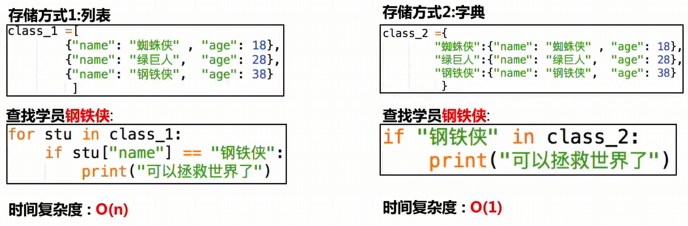
3. 最优数据结构+最优算法=好算法

#### 2.2内存的存储结构
1. 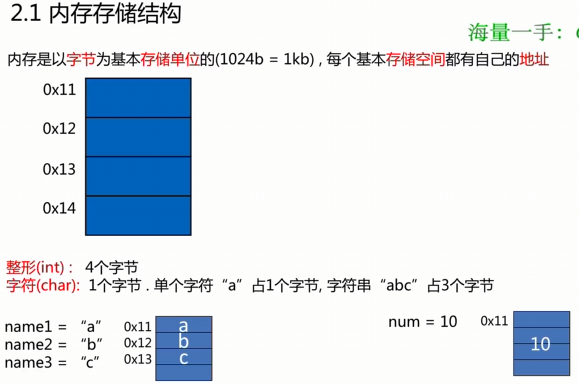
2. 内存是以字节作为基本存储单位的，每个基本存储空间都有自己的地址，内存地址是连续的
3. 整形int占4个字节，字符char占1个字节

#### 2.3 数据结构的类型

从线性结构分类：
1. 线性结构：简单来说就是表中各个**节点**具有线性关系，典型的线性结构：栈，队列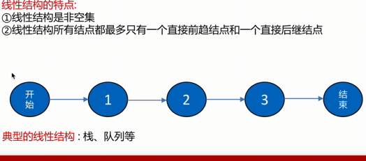
2. 非线性结构：表中各个节点有多个对应关系，典型的有树结构和图结构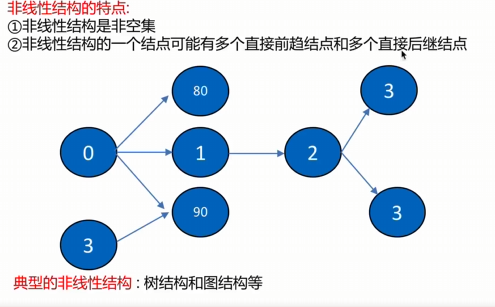

### 3、 顺序表存储方式

线性结构存储方式的分类，线性结构的实际村塾方式分为两种实现模型：
1. 顺序表：将元素顺序地存放在一块连续的存储区里，元素间的顺序关系由它们的存储顺序自然的表示
2. 链表：将元素放在通过链接构造起来的一系列存储快中，存储区是非连续的
3. 顺序表和链表都是线性的存储结构，我们称之为线性表

#### 3.1 顺序表
1. 一体式结构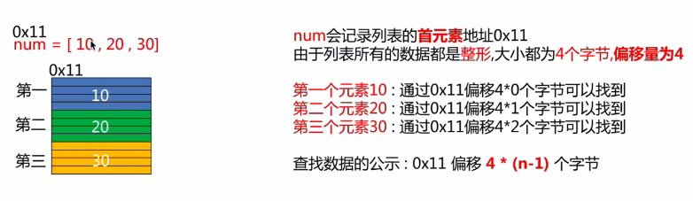
2. 分离式结构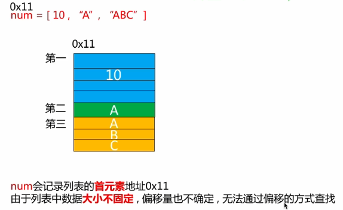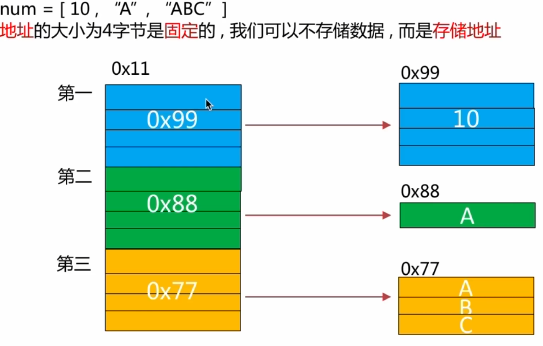
3. 无论是一体式结构还是分离式结构，在获取数据的时候直接通过下表偏移就可以找到数据所在的地址

#### 总结：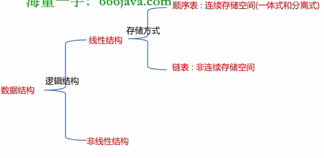

#### 3.2 顺序表的实现和扩充

顺序表的完整信息包含两个部分：数据表和信息表（即元素存储的容量和当前表中已有的元素个数）

当数据区需要更换为存储空间更大的区域时：如下
1. 每次扩充增加固定数目的存储位置，如每次扩充增加10个元素的位置，这种策略成为线性增长，特点时节省空间，但是扩充操作频繁，操作次数多
2. 每次扩充容量加倍，如每次扩充增加一倍存储空间，特点时减少了扩充操作的执行次数，但可能会浪费空间资源，以空间换时间，推荐的方式

#### 3.3 顺序表增加与删除元素

添加元素：
1. 表尾加入元素，时间复杂度为O（1）
2. 非保序元素插入（不常见），时间复杂度为O（1）
3. 保序元素加入，时间复杂度为O（n）
4. 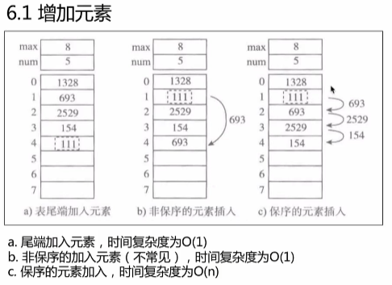

删除元素：
1. 删除表尾元素，
2. 非保序元素删除（不常见），时间复杂度为O（1）
3. 保序元素删除，时间复杂度为O（n）
4. 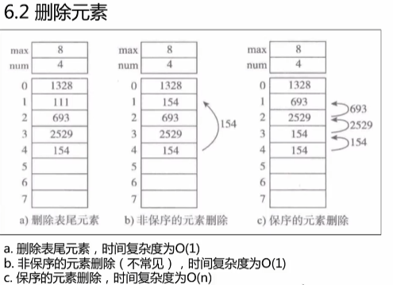

### 4、链表
#### 4.1 链表的结构

1. 链表不需要连续的存储空间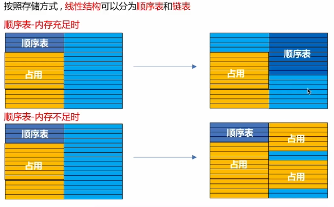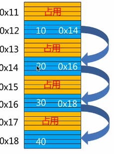
2. 链接包含表元素域和下结点链接域 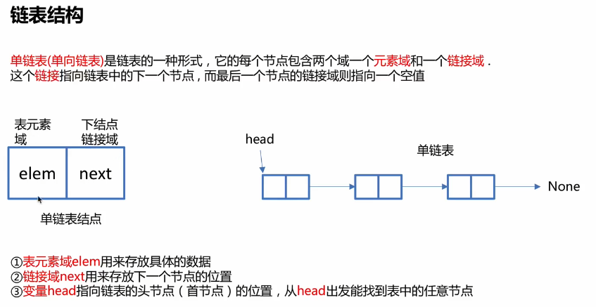
3. 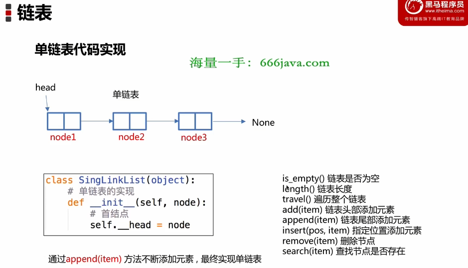

### 5. 算法

算法的稳定性： 假设在待排序的记录序列中，存在多个具有相同的关键字的记录，若经过排序，这些记录的相对次序保持不变，则称这种排序算法时稳定的，否则成为不稳定的
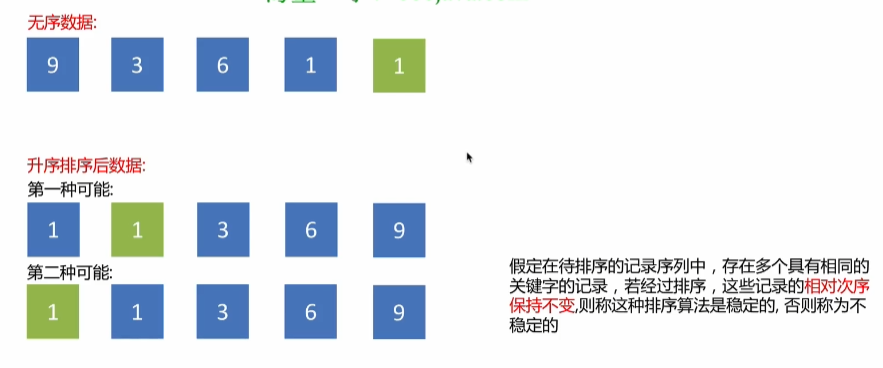

不稳定的排序算法：选择排序，快速排序，希尔排序，堆排序

稳定的排序算法： 冒泡排序，插入排序， 归并排序和基数排序
#### 5.1 冒泡排序
1. 定义：重复地走访要排序的元素列，一次比较相邻的元素，如果不满足顺序，就把他们交换过来。走访元素的工作是重复地进行知道没有相邻元素需要交换，也就是说该元素列已经排序完成
2. 冒泡排序实现过程：5个数字要比较4轮
3. 53472
3. 34527
4. 34257
5. 32457
6. 23457
#### 5.2 选择排序
1. 定义：第一次从待排序的数据元素中选出最小或最大的一个元素，存放在序列的起始位置，然后从升序的未排序的元素中寻找到最小或最大元素，放到已排序的序列末尾，以此类推，知道全部排序的数据元素为零
#### 5.3 插入排序
1. 基本操作是吧一个数据插入到已经排好序的数据中，从而得到一个新的，个数加一的有序数据，算法适用于少量数据的排序
2. 插入算法吧排序的数组分成两部分，第一部分是有序的数字，这里可以默认数组第一个数字为有序的第一部分，第二部分为无序的数字
#### 5.4 快速排序
