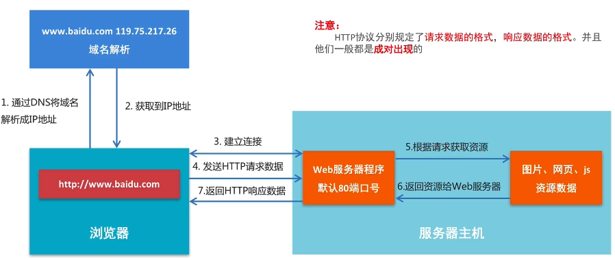

### 1、 HTTP协议
#### 1.1 概念
1. 超文本传输协议，在文本的基础上还包含非文本数据，包含图片、音乐等，而这些非文本数据会使用链接的方式进行加载显示，通俗来说超文本就是带有链接的文本数据，也就是我们常说的网页数据
2. 由1991年设计出来，现在容许传输任何类型的数据
3. 传输HTTP协议格式的数据是基于TCP传输协议的，发送数据之前需要先建立链接，TCP传输协议ishi用来保证网络中传输的数据安全性，HTTP协议是用来规定这些数据的具体格式

#### 1.2 浏览器访问流程
1. 

### 1、 静态服务器的搭建
#### 1.1 使用python搭建
1. python3 -m http.server 1314，在本地创建静态网址，端口号为1314

#### 1.2 静态Web服务器-返回固定页面数据

开发步骤：
1. 编写一个TCP服务端程序
2. 获取浏览器发送的HTTP请求报文数据
3. 读取固定页面数据，把页面数据组装成HTTP响应报文数据发送给浏览器
4. HTTP相应报文数据发送以后，关闭服务于客户端的套接字

